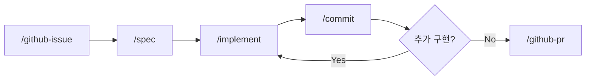
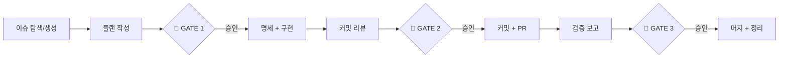

# AI-Native Development Guide

Claude Code 기반 개발 워크플로우 (이슈 사이클 + 사고 도구)

## 요구사항

- [Claude Code CLI](https://docs.anthropic.com/en/docs/claude-code) 설치
- GitHub CLI (`gh`) 설치
- 추가 플러그인 불필요

## GitHub 인증 설정

devex 스킬(`/github-issue`, `/github-pr` 등)은 `gh` CLI를 사용합니다. 보안 수준에 따라 두 가지 방식을 지원합니다.

### A. 제로 트러스트 (기본)

매 GitHub 작업마다 사용자 승인을 요구합니다. 별도 설정 없이 기본 동작합니다.

```bash
# GitHub CLI 인증 (최초 1회)
gh auth login
```

`settings.json`에 `Bash` 권한이 없으므로 `gh` 명령 실행 시 매번 승인 프롬프트가 표시됩니다.

### B. 클래식 토큰 (편의 모드)

GitHub 작업을 자동 승인하여 사이클 워크플로우를 간소화합니다.

1. GitHub CLI 인증:
   ```bash
   gh auth login
   ```
2. `settings.local.json`에 `gh` 명령 허용 추가:
   ```json
   {
     "permissions": {
       "allow": [
         "Bash(gh:issue:*)",
         "Bash(gh:pr:*)",
         "Bash(gh:label:*)",
         "Bash(gh:api:*)"
       ]
     }
   }
   ```

> `settings.local.json`은 `.gitignore`에 포함되어 Git에 추적되지 않습니다.

| 항목 | 제로 트러스트 | 클래식 토큰 |
|------|:---:|:---:|
| GitHub 인증 | `gh auth login` | `gh auth login` |
| 매 작업 승인 | 필요 | 불필요 |
| 보안 수준 | 높음 | 보통 |
| 편의성 | 보통 | 높음 |

## 개발 사이클

```
Issue → Spec → Implement → Commit → PR
```

| 단계 | 스킬 | 설명 |
|------|------|------|
| 이슈 | `/github-issue` | GitHub 이슈 생성, 라벨 매핑, 브랜치명 제안 |
| 명세 | `/spec` | 요구사항 분석, 아키텍처 설계, 다이어그램 |
| 구현 | `/implement` | 설계 문서 기반 코드 구현 |
| 커밋 | `/commit` | diff 리뷰, 커밋 메시지 제안, 커밋 |
| PR | `/github-pr` | PR 생성, 이슈 연결 |
| 전체 사이클 | `/cycle` | 이슈 → 플랜 → 구현 → 리뷰 → PR → 검증 → 완료 |
| 포스팅 | `/post` | 블로그 포스팅 작성, 참조 프로젝트 관리 |

### Thinking 스킬

의사결정과 검증을 구조화하는 사고 도구. 이슈 사이클과 독립적으로 사용하거나 연계할 수 있습니다.

| 스킬 | 설명 | 자연어 예시 |
|------|------|------------|
| `/decision-record` | 아키텍처 의사결정 기록 (MADR 기반, 파기 조건 포함) | "이 결정 기록해줘" |
| `/verify` | 3-Layer 정합성 검증 (Philosophy → Strategy → Tactics) + Devil's Advocate | "이 설계 검증해줘" |
| `/dependency-map` | 의존성 맵 생성, 변경 영향도 분석 (Mermaid) | "의존성 분석해줘" |

**사이클 연계:**
- `/decision-record` → `/spec`: 명세 작성 시 관련 ADR 참조
- `/verify` → `/github-pr`: PR 본문에 검증 결과 첨부
- `/dependency-map` → `/spec`: 변경 영향도 사전 분석

### 사이클 흐름



### 전체 사이클 (`/cycle`)



## 이슈 사이징 기준

1개 이슈 = 1개 개발 사이클의 단위

| 항목 | 기준 |
|------|------|
| 작업 시간 | 1일 8시간 이내 완료 가능 |
| 변경 파일 수 | 15개 미만 |
| PR 단위 | 이슈 1개 = PR 1개 |

> **예외**: 리팩토링, 패키지 변경 등 단순 반복 변경으로 파일 수가 많은 경우는 파일 수 제한에서 제외합니다.

### 이슈가 너무 크다면

- 하위 이슈로 분할
- 각 하위 이슈가 위 기준을 만족하도록 조정
- 각각 독립적으로 PR 가능한 단위로 분리

## 스킬 동작 방식

스킬은 `.claude/skills/*/SKILL.md` 파일로 정의됩니다.

| 특성 | 설명 |
|------|------|
| 로딩 시점 | `/스킬명` 슬래시 커맨드 입력 시에만 로딩 |
| 토큰 소비 | 호출 전까지 컨텍스트에 포함되지 않음 |
| 의존성 | Claude Code CLI만 필요 (플러그인 불필요) |

비교:

| 파일 | 로딩 | 토큰 영향 |
|------|------|-----------|
| `CLAUDE.md` | 매 턴 자동 로딩 | 항상 소비 |
| `skills/*/SKILL.md` | `/명령어` 호출 시만 | 호출 시만 소비 |

> **설계 원칙**: 항상 적용되는 규칙은 `CLAUDE.md`에, 특정 워크플로우 상세는 `skills/`에 분리하여 토큰을 절약합니다.

## 디렉토리 구조

```
.claude/
├── README.md               # 이 파일 (워크플로우 가이드)
├── settings.json            # 공통 설정 [Git 추적]
├── settings.local.json      # 로컬 설정 [Git 무시]
├── project-profile.md       # 프로젝트 프로필 [Git 추적]
├── .devex-version           # 설치된 devex 버전 [다운스트림만]
└── skills/                  # 워크플로우 스킬 [Git 추적]
    ├── github-issue/SKILL.md  # /github-issue
    ├── spec/SKILL.md          # /spec
    ├── implement/SKILL.md     # /implement
    ├── commit/SKILL.md        # /commit
    ├── github-pr/SKILL.md     # /github-pr
    ├── cycle/SKILL.md         # /cycle
    ├── post/SKILL.md          # /post
    └── thinking/                     # 사고 도구
        ├── decision-record/SKILL.md  # /decision-record
        ├── verify/SKILL.md           # /verify
        └── dependency-map/SKILL.md   # /dependency-map
```

## 프로젝트 프로필

프로젝트별 특수성을 `.claude/project-profile.md`로 정의하면, `/spec`과 `/implement` 스킬이 해당 프로필에 맞춰 동작합니다.

### 동작 원리

1. `/spec` 또는 `/implement` 호출 시
2. `.claude/project-profile.md` 존재 여부 확인
3. 존재하면: 프로필의 해당 컨텍스트 섹션을 읽고 따름
4. 없으면: 기본값 (코드 아키텍처 설계/구현)으로 동작

### 프로필 구성 항목

| 섹션 | 설명 |
|------|------|
| 산출물 유형 | 주요 산출물, 빌드 도구, 테스트 방법 |
| `/spec 컨텍스트` | 설계 대상, 명세 항목, 다이어그램 방식 |
| `/implement 컨텍스트` | 구현 대상, 구현 순서, 검증 기준 |
| 제약사항 | 프로젝트 고유 제약 |

> 프로필은 프로젝트마다 직접 작성합니다. `setup.sh` 업데이트 시에도 보존됩니다.

## 다른 프로젝트에 적용

### setup.sh 사용 (권장)

```bash
# 신규 설치
curl -sL https://raw.githubusercontent.com/idean3885/claude-devex/main/setup.sh | bash

# 버전 확인
curl -sL .../setup.sh | bash -s -- --check

# 업데이트
curl -sL .../setup.sh | bash -s -- --update
```

### 수동 복사

```bash
cp -r .claude/ /path/to/other-project/.claude/
```

### 업데이트 안전 영역

| 영역 | 업데이트 대상 | 관리 주체 |
|------|:---:|------|
| `.claude/skills/` | O | devex |
| `.claude/README.md` | O | devex |
| `.claude/project-profile.md` | X | 프로젝트 |
| `.claude/settings.json` | X | 프로젝트 |
| `CLAUDE.md` | X | 프로젝트 |

프로젝트별 커스텀:
- `.claude/project-profile.md` 작성 (스킬 동작 조정)
- `CLAUDE.md`에 프로젝트 고유 규칙 추가
- `settings.local.json`에 로컬 설정 추가
