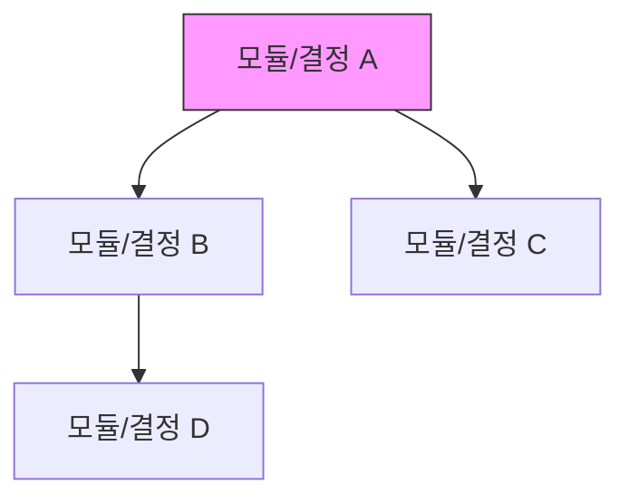

# Dependency Map Skill

의존성 맵 생성 워크플로우

## 역할

프로젝트 내 기술 선택, 모듈, 또는 결정 간의 의존 관계를 분석하고 Mermaid 다이어그램으로 시각화한다. 변경 시 영향 범위(blast radius)를 파악하여 안전한 의사결정을 돕는다.

## 트리거

- "dependency-map", "의존성", "의존성 분석", "영향도"

## 워크플로우

1. **분석 대상 파악**: 사용자에게 매핑할 대상(모듈, 기술 스택, ADR 등)을 확인한다.
2. **의존성 수집**:
   - 코드 기반: import/require, 설정 파일, 패키지 의존성 분석
   - 결정 기반: ADR 간 참조, 기술 선택 간 의존 관계 분석
   - `docs/decisions/` 디렉토리가 있으면 ADR 간 관계도 포함한다
3. **직접 의존성 매핑**: A → B (A가 B에 의존)
4. **역방향 의존성 매핑**: B ← A (B를 변경하면 A가 영향받음)
5. **다이어그램 생성**: Mermaid로 의존성 그래프를 작성한다.
6. **변경 영향도 분석**: 특정 노드 변경 시 영향받는 범위를 표시한다.
7. **사용자 보고**: 다이어그램과 분석 결과를 제시한다.

## 출력 형식

### 의존성 다이어그램



### 변경 영향도 테이블

```markdown
## 변경 영향도: {대상}

### 직접 의존성 (이것이 의존하는 것)

| 대상 | 관계 | 설명 |
|------|------|------|
| B | 직접 의존 | ... |

### 역방향 의존성 (이것에 의존하는 것)

| 대상 | 관계 | 영향 수준 |
|------|------|-----------|
| X | 직접 영향 | HIGH/MEDIUM/LOW |

### 영향 범위 요약

- 직접 영향: N개
- 간접 영향: M개
- 총 영향 범위: ...
```

## 사이클 연계

- `/decision-record` 연계: ADR 간 의존 관계를 시각화할 수 있다.
- `/spec` 연계: 명세 작성 시 변경 영향도를 사전 분석하여 범위를 결정할 수 있다.

## 규칙

- 다이어그램은 Mermaid로 작성한다 (CLAUDE.md 다이어그램 규칙 준수)
- 순환 의존성이 발견되면 명시적으로 경고한다
- 분석 범위가 너무 넓으면 사용자에게 범위 축소를 제안한다
- 출력은 마크다운으로 작성하여 Git 추적 및 README 임베딩이 가능하게 한다
