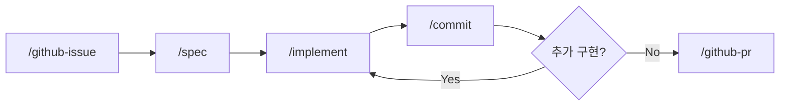

## AI로 코드를 짜기 시작했다

Claude Code(Anthropic의 터미널 기반 AI 코딩 도구)로 코드를 짜기 시작했습니다.
생성 속도는 확실히 빨라졌습니다.

근데 막상 일해보니 **반복되는 작업이 오히려 늘었습니다.**

이슈 만들고, 브랜치 따고, 명세 쓰고, 구현하고, 커밋하고, PR 올리고.
매번 같은 흐름인데 매번 수작업이었습니다.

코드 생성 속도는 훨씬 빨라졌지만, 프로젝트가 그만큼 잘 되지는 않았습니다.
빠르게 만들수록 설계 없이 만들고, 추적할 수 없는 변경이 쌓이고,
"이거 왜 이렇게 됐지?"가 늘어났습니다.

여기서 "AI를 어떻게 써야 하는가"에 대한 생각이 시작됐습니다.

## 바뀐 생각들

### 1. AI가 코드를 짜니까, 사람은 프로세스를 짜야 한다

AI가 코드 생성을 빠르게 하니까,
정작 중요해진 건 **어떤 순서로 어떤 규칙으로 일할지**인 것 같습니다.

문서에 "이렇게 개발하세요"라고 적어놓는 건 의미가 없었습니다.
아무도 안 읽습니다. 저도 안 읽습니다.

그래서 방법론을 **실행 가능한 도구**로 만들어보고 있습니다.
매번 같은 흐름이면 사이클로 정의하고, 슬래시 커맨드로 만들었습니다.

```
/github-issue → /spec → /implement → /commit → /github-pr
```

> 이 다섯 개 커맨드가 **이슈 사이클**입니다.
> 이슈 생성부터 PR까지, 하나의 개발 단위가 완결되는 전체 흐름을 순서대로 실행합니다.
{: .prompt-info }



### 2. 설계가 구현보다 먼저다

AI가 빠르게 만들 수 있으니까, 오히려 **무엇을 왜 만드는가**가 중요해졌습니다.

명세를 먼저 쓰면, 변경 이력도 추적할 수 있고, 설명할 수 있고, 되돌릴 수도 있습니다.
1개 이슈 = 1개 명세 = 1개 PR = 1개 머지.
독립적으로 완결되는 단위로 나누는 게 중요했습니다.

`/spec` 없이는 `/implement`가 동작하지 않게 만들었습니다.

> 빠르게 만들 수 있는 시대일수록, 천천히 생각하는 구간이 필요합니다.
{: .prompt-tip }

### 3. 반복은 자동화해야 한다

매번 같은 흐름을 반복하면, 그건 사이클로 만들어야 합니다.

"설계를 먼저 하세요"라고 문서에 적는 대신,
도구 자체가 그 흐름을 구현하게 했습니다.
방법론을 강제하는 게 아니라,
자연스럽게 그 흐름을 따르게 되는 구조를 만들어보는 중입니다.

## 만든 것

이런 생각들을 반영해서 만든 게 [claude-devex](https://github.com/idean3885/claude-devex)입니다.
슬래시 커맨드 5개, 설치 스크립트 1개, 가이드 문서 몇 개. 복잡하지 않습니다.

코드를 덜 짜게 되니, 다음 질문은 자연스럽게 찾아왔습니다.
그럼 개발자는 뭘 해야 하는가, 였습니다.

---

*이 글은 Claude의 도움을 받아 작성했습니다.*
