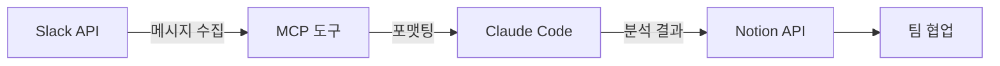

## 왜 만들었는가

비개발자 동료에게서 이런 이야기를 들었습니다.

"Slack 스레드에 댓글이 200개 넘게 쌓였는데,
복사해서 AI에 넣으면 중간이 잘리거나 엉뚱하게 정리해줘요."

실제로 그렇습니다.
Slack 스레드는 대화가 길어질수록 맥락이 뒤섞입니다.
그걸 통째로 복사해서 AI에게 넘기면,
토큰 제한에 걸리거나 맥락을 잘못 해석합니다.

이 문제를 듣고 생각했습니다.
직전까지 만들어온 이슈 사이클과 설계 원칙이 있으니,
실제 불편사항에 적용해볼 수 있겠다.
적응기에서 정립한 방법론의 첫 번째 실전 투입이었습니다.

## 무엇을 만들었는가

[claude-slack-to-notion](https://github.com/dykim-base-project/claude-slack-to-notion) —
Slack 채널의 대화를 수집하고,
AI가 분석해서,
Notion 페이지로 정리하는 도구입니다.

Claude Code 플러그인 형태로 동작합니다.
설치하면 자연어로 바로 사용할 수 있습니다.

```
"#backend 채널의 최근 50개 메시지를 Notion에 정리해줘"
"이 스레드 내용을 주제별로 분류해서 Notion 페이지로 만들어줘"
```

데이터 흐름은 단순합니다.



핵심은 **역할 분리**입니다.
도구는 수집과 포맷팅만 하고, 분석은 AI에게 맡기고,
어떤 방향으로 정리할지는 사용자가 결정합니다.

## 어떻게 만들었는가

이전 포스팅에서 만든
[이슈 사이클](https://github.com/idean3885/claude-devex)을
그대로 적용했습니다.

```
/github-issue → /spec → /implement → /commit → /github-pr
```

모든 변경이 이 흐름을 따랐습니다.
초기 구조 설계, Slack 수집 모듈, 분석 모듈, Notion 연동,
MCP 서버 통합, 리팩토링까지 —
각 단계가 하나의 이슈-명세-구현-PR로 완결되는 단위였습니다.

방법론을 실제로 돌려보니 보이는 것들이 있었습니다.

**명세를 먼저 쓰니까 구현이 빨랐습니다.**
어디까지 만들지가 명확하니, AI에게 정확한 지시를 줄 수 있었습니다.
"Slack API에서 메시지를 가져오는 함수를 만들어줘"가 아니라,
"이 명세대로 SlackClient 클래스를 구현해줘"가 되었습니다.

**이슈 단위로 나누니까 되돌리기가 쉬웠습니다.**
E2E 테스트에서 Notion Database 방식이 한글 프로퍼티와
호환되지 않는 문제를 발견했습니다.
DB 방식을 버리고 직접 페이지 생성으로 전환했는데,
이슈 단위로 분리되어 있었기 때문에 영향 범위가 명확했습니다.

## 설계에서 고민한 것들

### Bot 토큰 vs 사용자 토큰

Slack 메시지를 읽으려면 토큰이 필요합니다.
두 가지 방식이 있습니다.

**Bot 토큰(`xoxb-`)**: 채널에 앱을 추가해야 합니다.
중립적이고, 사용자와 독립적이며, 채널과 생명주기를 함께합니다.
한 명이 설정하고 `.env` 파일을 공유하면 팀 전체가 쓸 수 있습니다.

**사용자 토큰(`xoxp-`)**: 본인이 참여한 채널에 바로 접근할 수 있습니다.
채널에 Bot을 넣는 게 부담스럽거나,
혼자 빠르게 시작하고 싶을 때 적합합니다.
대신 발급자가 워크스페이스를 떠나면 토큰이 무효화됩니다.

처음에는 하나만 지원하려 했습니다.
하지만 실사용 시나리오를 생각하면 둘 다 필요했습니다.

"대화방에 Bot을 넣으면 다른 사람들이 알아차릴 수 있다."
"한 명이 설정하고 공유하는 게 간편하다."
이 두 가지 현실 사이에서 선택지를 남겨두는 게 맞았습니다.

### 토큰 우선순위

둘 다 설정되어 있으면 어떻게 할 것인가.
단순한 문제 같지만 틀리면 장애가 납니다.

Bot 토큰을 우선하기로 했습니다.
권장 방식이 기본값이어야 합니다.
사용자 토큰은 Bot을 사용할 수 없는 상황에서의 대안이므로,
의도적으로 Bot 토큰을 비워야만 사용자 토큰이 동작합니다.

```python
token = os.environ.get("SLACK_BOT_TOKEN") or os.environ.get("SLACK_USER_TOKEN")
token_type = "user" if token.startswith("xoxp-") else "bot"
```

접두사(`xoxb-`, `xoxp-`)로 자동 감지합니다.
사용자가 토큰 타입을 별도로 명시할 필요가 없습니다.

### 비개발자를 위한 가이드

이 도구의 사용자는 개발자가 아닙니다.
기획자, 사업 담당자, 팀원 누구나 쓸 수 있어야 합니다.

README를 작성한 뒤 처음부터 직접 따라가며 검증했습니다.
그 과정에서 발견한 것들:

- Notion UI가 한글화되어 있어 영문 가이드가 무의미
- `/invite @봇이름`이 App에는 동작하지 않음
- "notion" 단어가 Integration 이름에 사용 금지
- Notion 페이지 URL에서 32자 ID를 추출하라는 안내가 비개발자에겐 불친절

URL을 그대로 붙여넣으면 Page ID가 자동 추출되도록 코드를 수정하고,
가이드의 모든 UI 용어를 실제 화면 기준으로 교정했습니다.

개발자에겐 당연한 것이 비개발자에겐 허들입니다.
가이드 작성도 사용자 경험이라는 걸 다시 느꼈습니다.

## 만들고 나서 든 생각

적응기에서 만든 방법론이 실제로 동작하는 걸 확인했습니다.
이슈 사이클이 강제하는 흐름 —
명세 먼저, 이슈 단위로 완결, 추적 가능한 변경 —
이 구조 덕분에 방향을 잃지 않고 만들 수 있었습니다.

동시에 부족한 점도 보였습니다.
비개발자 관점의 검증이 부족했고,
실제 현장에서 쓰이려면 아직 다듬어야 할 것이 많습니다.

다음 포스팅에서는 이 도구를 실제로 적용해본 후기를 공유할 예정입니다.
200개 넘는 스레드를 실제로 정리해보면서
느낀 것들을 기록하겠습니다.

---

*이 글은 Claude의 도움을 받아 작성했습니다.*
