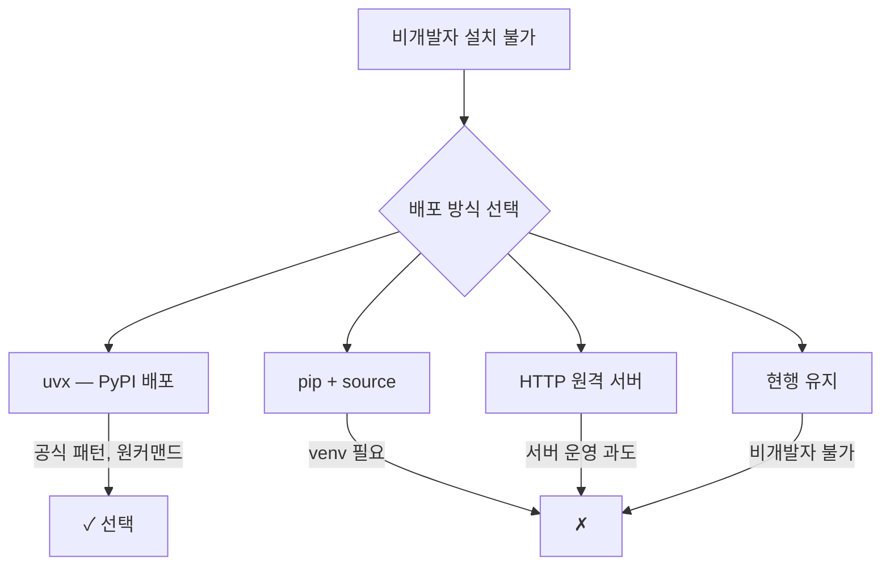

## 검증하러 갔다가 설계를 바꾸게 됐다

[지난 포스팅](https://idean3885.github.io/posts/building-first-tool-with-ai/)에서
이슈 사이클로 첫 도구를 만들었습니다.
Slack 스레드를 Notion으로 정리하는 MCP 플러그인,
[claude-slack-to-notion](https://github.com/dykim-base-project/claude-slack-to-notion)이었습니다.

만들고 나서 든 생각은 "이제 검증해야 한다"였습니다.
비개발자 관점의 검증이 부족하다는 건 제작 과정에서도 느끼고 있었습니다.

그래서 테스트를 시작했습니다.
버그 몇 개 잡고 끝날 줄 알았습니다.
결과적으로 배포 아키텍처 자체를 전환하게 됐습니다.

## 테스트 전략 — 개발자와 비개발자를 분리하다

테스트를 시작하기 전에 전략을 세웠습니다.
누가 어떤 관점으로 테스트할 것인가.

두 가지 축으로 나눴습니다.

| 구분 | 개발자 테스트 | 비개발자 E2E |
|------|-------------|-------------|
| 관점 | MCP 서버 내부 동작 | 설치부터 결과 확인까지 |
| 방법 | JSON-RPC stdin 직접 호출 | Claude Code에서 자연어로 요청 |
| 목적 | 기능 정확성 검증 | 사용자 경험 검증 |

개발자 테스트는 직접 할 수 있었습니다.
비개발자 E2E는 실제 비개발자에게 부탁해야 했습니다.

테스트 환경도 분리했습니다.
프로덕션 워크스페이스를 오염시키지 않도록
별도의 Slack 테스트 워크스페이스를 만들었습니다.

## 개발자 테스트 — 에러 케이스가 말해준 것들

MCP 서버는 JSON-RPC 프로토콜로 동작합니다.
stdin으로 요청을 보내면 stdout으로 응답이 옵니다.
이 방식으로 서버를 직접 테스트했습니다.

정상 케이스 12개는 모두 통과했습니다.
문제는 에러 케이스에서 나왔습니다.

### 에러 메시지 한글화 누락

에러가 발생하면 영문 메시지가 그대로 노출됐습니다.
이 도구의 사용자는 비개발자입니다.
"Invalid token" 대신 "토큰이 유효하지 않습니다"가 나와야 합니다.

에러 메시지 전체를 한글화했습니다.
동시에 에러 코드 체계도 정리했습니다.

### limit=0 검증 누락

메시지 조회 시 `limit` 파라미터에 0을 넣으면
검증 없이 그대로 Slack API에 전달됐습니다.
Slack API는 limit=0을 허용하지만 빈 결과를 반환합니다.
사용자 입장에서는 "왜 아무것도 안 나오지?"가 됩니다.

최소값 검증을 추가하고,
범위를 벗어나면 이유를 설명하는 메시지를 넣었습니다.

### 설치 가이드의 혼란

직접 README대로 설치해보면서 발견했습니다.

- 클론 위치에 대한 안내가 모호함
- `.env` 파일 경로가 상대경로로 되어 있어
  현재 디렉토리에 따라 동작이 달라짐
- 비개발자에게는
  "터미널에서 다음을 실행하세요"부터가 허들

가이드를 처음부터 다시 따라가보는 것만으로
세 가지 개선점을 찾았습니다.

## 비개발자 E2E를 기획하다 — 설치 경로가 없었다

개발자 테스트에서 버그를 잡은 뒤,
비개발자 E2E 테스트를 기획했습니다.

시나리오를 작성하려고 첫 단계부터 적어봤습니다.

"1. 설치한다."

여기서 멈췄습니다.

현행 설치 과정은 이랬습니다.

```bash
# 6단계
git clone https://github.com/.../claude-slack-to-notion.git
cd claude-slack-to-notion
cp .env.example .env
# .env 편집...
cd ~/my-project
claude --plugin-dir ~/claude-slack-to-notion  # 매 세션마다
```

6단계.
`git clone`부터 시작합니다.
비개발자에게 Git은 낯선 도구입니다.
Python 가상환경 설정은 더 낯섭니다.

**비개발자 설치 경로 자체가 존재하지 않았습니다.**

E2E 테스트를 "기획"하는 단계에서
아키텍처 문제를 발견한 겁니다.

### 공식 MCP 서버는 어떻게 하고 있나

Claude Code 공식 플러그인들의 설치 방식을 조사했습니다.

| 패턴 | 예시 | 특징 |
|------|------|------|
| HTTP 원격 서버 | Sentry, Linear | 서버 운영 필요 |
| **npx / uvx** | **mcp-server-git** | **패키지 레지스트리에서 자동 실행** |
| 번들 스크립트 | 커뮤니티 플러그인 | 의존성 관리 복잡 |

Anthropic 공식 MCP 서버인 `mcp-server-git`이 사용하는 패턴은
**uvx(Python)** 또는 **npx(Node.js)** 기반 자동 실행이었습니다.

### 4가지 옵션을 비교하다



| 옵션 | 장점 | 단점 |
|------|------|------|
| **uvx (선택)** | 공식 패턴, 원커맨드 실행 | PyPI 배포 필요 |
| pip + source | PyPI 불필요 | 글로벌 pip 오염, venv 필요 |
| HTTP 원격 | 설치 없음 | 서버 운영 비용, 과도한 구조 |
| 현행 유지 | 변경 없음 | 비개발자 설치 불가 |

uvx를 선택했습니다.
이유는 세 가지였습니다.

1. **공식 패턴 준수** — `mcp-server-git`과 정확히 같은 구조
2. **사용자 경험** — `uvx slack-to-notion-mcp` 한 줄로 실행
3. **자동 의존성 관리** — 가상환경과 패키지 설치를 uvx가 처리

### 자바 개발자가 만난 Python 생태계

저는 자바 개발자입니다.
uvx, PyPI 같은 도구는 이번에 처음 접했습니다.

낯설었지만, 개념은 익숙했습니다.
생태계만 다를 뿐 하는 일은 같았기 때문입니다.

| Java | Python | 역할 |
|------|--------|------|
| Maven Central | PyPI | 패키지 저장소 |
| jbang | uvx | 한 줄 실행 도구 |
| pom.xml | pyproject.toml | 프로젝트 정의 |
| mvn deploy | twine upload | 패키지 배포 |

uv/uvx의 성장세도 인상적이었습니다.
GitHub 스타 79.4k, PyPI 점유율 13.3%,
JetBrains 설문에서 0%→11%로 급등(2024→2025).
Python 생태계에서 빠르게 표준으로 자리잡고 있었습니다.

### 6단계에서 2단계로

전환 결과는 명확했습니다.

**변경 전 — 6단계:**

```bash
git clone → cd → cp .env → 편집 → cd → claude --plugin-dir
```

**변경 후 — 2단계:**

```bash
brew install uv                    # 최초 1회
claude mcp add slack-to-notion \
  -- uvx slack-to-notion-mcp       # 최초 1회
```

`git clone`도, Python 설정도,
매 세션 `--plugin-dir` 지정도 사라졌습니다.

## 테스트에서 발견한 것들

개발자 테스트와 E2E 기획을 통해
발견한 전체 사항을 정리합니다.

| 분류 | 발견 | 영향도 |
|------|------|--------|
| 버그 | 에러 메시지 한글화 누락 | 사용자 경험 |
| 버그 | limit=0 검증 누락 | 기능 정확성 |
| 문서 | 클론 위치·.env 경로 혼란 | 설치 경험 |
| 문서 | 비개발자 용어 불일치 | 접근성 |
| **아키텍처** | **비개발자 설치 경로 부재** | **배포 구조 전환** |

버그와 문서 이슈는 예상 범위였습니다.
아키텍처 전환은 예상하지 못한 발견이었습니다.

## 돌아보며

테스트를 시작할 때는 "버그를 찾자"가 목표였습니다.
결과적으로 버그도 찾았지만,
더 큰 발견은 아키텍처였습니다.

"비개발자 E2E를 기획한다"는 행위 자체가 관점을 바꿨습니다.
개발자 관점에서는 보이지 않던 문제 —
"이 도구를 설치할 수 있는 사람이 개발자뿐이다" —
가 E2E 시나리오의 첫 줄에서 드러났습니다.

테스트는 "만든 것이 동작하는지 확인하는 것"이라 생각했습니다.
이번 경험은 달랐습니다.
테스트가 확인이 아니라 재설계의 계기가 될 수 있다는 걸 알게 됐습니다.

---

*이 글은 Claude의 도움을 받아 작성했습니다.*
