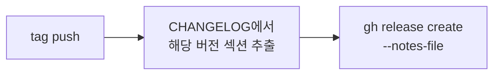

> **TL;DR**<br>
> GitHub Release 자동화는 `태그 생성` → `Release 생성` 2단계 워크플로우로 분리할 때 안정적입니다.<br>
> CHANGELOG.md가 태그와 Release 본문을 잇는 중심 축 역할을 합니다.<br>
> 특수문자 이스케이프 문제는 `--notes-file` 옵션 하나로 끝납니다.
{: .prompt-tip }

## 관성으로 쓰던 태그와 릴리즈

몇 년 전 업무 프로젝트에서 배포 구조가 정비되던 시기에 태그와 Release를 처음 썼습니다.
당시에는 태그 생성 시 제목과 본문을 매번 수동으로 채웠습니다.
"왜 굳이 태그/릴리즈로 구분하지?"라고 생각하면서도 관성적으로 이어왔습니다.

유용함을 느낀 것은 운영이 쌓인 뒤였습니다.
"배포 당시 코드가 뭐였지?"라는 질문이 들어올 때마다 Release가 체크포인트 역할을 해주었습니다.
그래도 그때는 CHANGELOG.md의 존재 이유를 몰랐습니다.
Release 본문은 여전히 손으로 다시 적어야 했습니다.

## AI가 풀어준 자동화 숙제

최근 개인 도구 작업이 AI 협업 중심으로 옮겨가면서,
반복되는 수작업을 자동화하는 것이 자연스러운 기본값이 됐습니다.
GitHub 설정 파일도 AI가 대신 수정해주니,
그동안 미뤄둔 릴리즈 자동화를 이번에 정리하기로 했습니다.

처음에는 단순히 태그만 자동으로 생성할 계획이었습니다.
그런데 "릴리즈 정보도 같이 기록하고 싶다"고 요청했더니
AI가 CHANGELOG.md를 제안했습니다.
그대로 설정했고, 첫 Release가 올라온 순간 퍼즐이 맞춰졌습니다.

**"아, 이래서 CHANGELOG.md를 쓰는구나."**

CHANGELOG.md는 단순한 변경 기록 파일이 아니었습니다.
태그와 Release를 잇는 중심 축이었습니다.
한 번 작성한 CHANGELOG 항목이 태그 메시지, Release 제목, Release 본문으로
자동 전파되는 구조였습니다.

## 2단계 워크플로우 구조

자동화는 두 개의 워크플로우로 분리했습니다.

### 1. `auto-tag.yml`: pyproject.toml 감지 → 태그

```mermaid
flowchart LR
    A[main push] --> B{pyproject.toml<br>version 변경?}
    B -->|Yes| C[v{version} 태그 생성/push]
    B -->|No| D[스킵]
```

main 브랜치에 변경이 들어올 때 `pyproject.toml`의 `version` 필드를 읽고
이전 태그와 비교합니다.
버전이 올랐다면 `vX.Y.Z` 형식으로 태그를 만들어 푸시합니다.

### 2. `auto-release.yml`: CHANGELOG 섹션 추출 → Release



태그 push 이벤트를 받으면 CHANGELOG.md에서 해당 버전의 섹션만 잘라
Release 본문으로 넘깁니다.

**분리한 이유**는 두 작업의 관심사가 다르기 때문입니다.
태그는 버전 번호 관리, Release는 릴리즈 노트 공개에 관여합니다.
하나로 묶으면 실패 시 디버깅이 까다로워지고 권한 범위도 불필요하게 넓어집니다.

## v2.2.4 시행착오: CHANGELOG 특수문자

2단계를 적용하고 v2.2.4 릴리즈를 찍었는데, Release 생성이 실패했습니다.
해당 버전 섹션 안에 `@`, `:`, 백틱 같은 특수문자가 섞여 있었습니다.

원인은 워크플로우가 CHANGELOG 섹션을 **문자열 변수**에 담고
`gh release create --notes "$CHANGELOG_SECTION"`으로 넘긴 방식에 있었습니다.
셸이 이 문자열을 명령어로 해석하려 들면서
특수문자가 포함된 줄에서 구문 오류가 발생했습니다.

해결은 한 줄이었습니다.

```yaml
# Before
- run: gh release create "$TAG" --notes "$CHANGELOG_SECTION"

# After
- run: |
    cat > /tmp/notes.md <<'EOF'
    ${{ env.CHANGELOG_SECTION }}
    EOF
    gh release create "$TAG" --notes-file /tmp/notes.md
```

`--notes-file`로 파일 참조로 바꾸면 셸 해석 단계가 빠집니다.
릴리즈 노트처럼 **본문성 텍스트**는 파일로 넘기는 쪽이 안전합니다.

## 정리

GitHub Release 자동화 작업에서 얻은 원칙 세 가지입니다.

1. **태그 생성과 Release 생성은 분리**: 관심사가 다르고, 디버깅과 권한 범위가 깔끔해집니다.
2. **CHANGELOG.md를 중심 축으로**: 한 번 작성한 텍스트가 태그 메시지와 Release 본문으로 자동 전파됩니다.
3. **본문성 텍스트는 파일로 전달**: `--notes-file` 같은 파일 참조 옵션을 사용하면 셸 이스케이프 문제를 우회할 수 있습니다.

돌아보면 CHANGELOG.md는 "사람이 읽을 변경 기록"이라기보다
"자동화가 참조할 단일 소스"에 가깝습니다.
몇 년간 태그/릴리즈를 관성으로 쓰던 감각이,
CHANGELOG 하나로 연결되는 순간에 깨졌습니다.

> 이 글은 Claude와 함께 작업했습니다.
{: .prompt-info }
