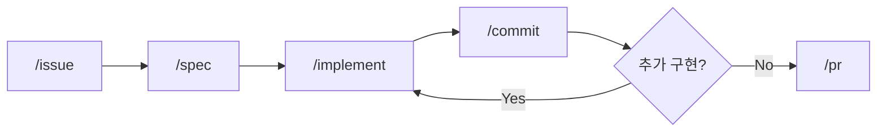

> **TL;DR**<br>
> AI가 코드를 짜는 시대에 사람의 시간은 코딩에서 판단으로 이동한다.<br>
> 반복은 도구로 강제하고, 판단은 사상-전략-전술 3겹으로 정렬하고, 도구는 본질을 좁히고 추상화로 통합한다.<br>
> 이 3단계가 6개월 적응기의 응축이다.
{: .prompt-tip }

## 1. AI로 코드를 짜기 시작했더니 반복이 늘었다

Claude Code (Anthropic의 터미널 기반 AI 코딩 도구) 로 코드를 짜기 시작했다. 생성 속도는 확실히 빨라졌다.

그런데 막상 일해보니 **반복 작업이 오히려 늘었다**. 이슈 만들고, 브랜치 따고, 명세 쓰고, 구현하고, 커밋하고, PR 올리고. 매번 같은 흐름인데 매번 수작업이었다.

코드 생성 속도는 빨라졌지만 프로젝트는 그만큼 잘 되지 않았다. 빠르게 만들수록 설계 없이 만들고, 추적할 수 없는 변경이 쌓이고, "이거 왜 이렇게 됐지?"가 늘어났다.

여기서 "AI를 어떻게 써야 하는가"가 시작됐다.

### 반복은 도구로 강제한다

문서에 "이렇게 개발하세요"라고 적어두는 건 의미가 없었다. 아무도 안 읽는다. 본인도 안 읽는다.

그래서 방법론을 **실행 가능한 도구**로 만들었다. 매번 같은 흐름이면 사이클로 정의하고 슬래시 커맨드로 변환했다.

```
/issue → /spec → /implement → /commit → /pr
```



`/spec` 없이는 `/implement` 가 실행되지 않게 막았다. 방법론을 강제하는 게 아니라, 자연스럽게 그 흐름을 따르게 되는 구조다. 결과물이 [claude-devex](https://github.com/idean3885/claude-devex).

> 빠르게 만들 수 있는 시대일수록 천천히 생각하는 구간이 필요하다.
{: .prompt-tip }

## 2. 코드 짜는 시간이 줄어든 자리에 판단이 들어왔다

AI에게 구현을 맡기니 시간이 남았다. 처음엔 뭘 해야 할지 몰랐다.

이슈 사이클을 몇 바퀴 돌리고 나서야 패턴이 보였다. 구현 코드를 작성하던 시간이 줄어든 자리에 **설계 검토, 결과물 반론 세우기, 기술 선택 판단**이 채워졌다. "어떻게 구현할까"보다 "왜 이렇게 만들어야 할까"를 먼저 묻게 된 변화다.

### 사상-전략-전술 3겹

이슈 사이클 초기에는 AI에게 "로그인 기능 만들어줘"라고 지시했다. 코드는 나왔지만 에러 처리 방식이 매번 달랐다. "왜 이렇게 처리해야 하는가"를 먼저 정하지 않았기 때문이다.

이 경험에서 세 겹의 판단이 필요하다는 걸 알게 됐다.

```
Philosophy (사상)
    ↓ 정보화
Strategy (전략)
    ↓ 구체화
Tactics (전술)
```

| 층 | 질문 | 예시 |
|---|---|---|
| Philosophy | "우리는 왜 이렇게 하는가" (변하지 않는 원칙) | "배우고 실험하면서도 신뢰성을 잃지 않는다" |
| Strategy | "어떤 방향으로 갈 것인가" (프로젝트별 중점) | "이 분기는 마이크로서비스 도입보다 안정화에 집중한다" |
| Tactics | "구체적으로 어떻게 구현하는가" (매일의 선택) | "에러는 항상 명시적으로 처리한다" |

대부분의 팀이 Tactics만 논의한다. "변수 이름 어떻게 짓지?", "이 함수는 어디에 둘까?" Philosophy 는 암묵적으로 방치되거나 팀원마다 다르다.

> AI 시대에 이것이 문제가 된다. AI에게 "왜"를 설명할 수 없으면 왜 틀렸는지 모르는 채로 잘못된 코드를 받아들이게 된다.
{: .prompt-warning }

### 비판이 먼저, 단순 지시는 그 다음

AI가 생성한 설계를 처음엔 그대로 썼다. 나중에 보니 과장되거나 불필요하게 복잡한 부분이 있었다.

그래서 AI가 내놓은 결과물에 "이게 정말 필요한가?", "더 단순한 방법은 없는가?"를 먼저 묻기 시작했다. 비판을 먼저 세우면 AI 와의 대화가 달라진다. "틀렸다"는 거부 대신 "이렇게 개선하자"는 제안이 된다. 그 방향으로 다시 지시하면 결과물이 한 단계 올라간다.

단순 지시로는 과장되거나 동작하지 않는 결과가 나온다. AI 는 "왜"를 모르기 때문에 그럴듯한 결과를 만들어낸다. "왜"를 아는 쪽이 판단해야 품질이 생긴다.

### 트레이드오프는 경험에서 나온다

마감이 촉박한데 신기술도 도입해야 하는 상황이 생긴다. Go/No-Go 기준이 없으면 결정이 흔들린다.

본인의 사례. 처음엔 k8s job 으로 배치 작업을 관리했다. 속도 문제로 JobRunr 로 마이그레이션했고, 규모가 커지니 결국 Airflow + k8s job 조합으로 돌아왔다. 각 단계의 선택이 틀렸던 게 아니라 그때 그 조건에선 최선이었다. 하지만 "언제까지 이 도구가 맞을까"를 미리 가정해두지 않았다면 더 늦게 알아챘을 거다.

AI 는 "이 기술이 좋습니다"는 답할 수 있지만 "언제까지 이 기술이 맞을까"는 답하지 못한다. 그 판단은 직접 겪어봐야 생긴다. 트레이드오프 판단은 기술력이 아니라 경험과 원칙에서 나온다.

## 3. 두 플러그인을 하나로: 사상이 설계를 만들었다

devex 를 만들고 한참 쓰니 도구가 두 개로 갈라졌다. devex 는 GitHub 기반 개인 프로젝트용, 다른 한 개는 별도 이슈 트래커용. 두 플랫폼의 API 가 다르니 별도 플러그인이 합리적이라고 생각했다.

시간이 지나면서 이중 관리 비용이 드러났다.

| 문제 | 상황 |
|---|---|
| 로직 중복 | 커밋 메시지 규칙, PR 생성 절차가 양쪽에 거의 동일 |
| 동기화 비용 | 한쪽 개선하면 다른 쪽도 수정. 잊기 쉬움 |
| 컨텍스트 낭비 | Claude 가 두 플러그인을 모두 로드하면서 컨텍스트 소모 |
| 용어 불일치 | "이슈 사이클" vs "이슈 플로우" (같은 개념, 다른 이름) |

"두 플러그인 관리 비용이 두 플러그인의 가치를 넘어서고 있다"는 판단이 들었다.

### 사상으로 통합 방향을 잡다

위에서 정리한 Philosophy-Strategy-Tactics 프레임워크를 이 문제에 적용했다.

- **Philosophy**: "개발 경험 도구는 플랫폼이 아니라 개발자의 워크플로우에 집중해야 한다."
- **Strategy**: "플랫폼 차이를 추상화해서 하나의 도구로 통합한다."
- **Tactics**: "Provider 패턴으로 플랫폼별 동작을 분리한다."

devex 의 핵심 가치는 "이슈에서 PR까지의 흐름을 자동화"이지 "GitHub API 를 호출하는 것"이 아니었다. 플랫폼은 수단이고 워크플로우가 본질이다.

### Provider 추상화: 전략의 구현

Provider 는 플랫폼별 이슈 동작을 정의하는 마크다운 파일이다.

```
devex/
├── providers/
│   ├── PROVIDER.md          # 템플릿
│   └── github.md            # GitHub 기본 내장
└── ~/.claude/devex/
    └── providers/
        └── internal.md      # 다른 플랫폼 (로컬 전용)
```

핵심 설계 결정은 **로컬 전용 provider 를 배포 범위에 포함하지 않는 것**. 외부 API 엔드포인트와 인증 정보는 로컬에만 존재해야 한다. devex 는 GitHub provider 를 기본 내장하고, 다른 플랫폼 provider 는 각 개발자가 로컬에 설정한다.

SessionStart 훅에서 git remote 의 host 를 감지하여 적합한 provider 를 자동 선택한다. 프로젝트를 열면 어떤 플랫폼인지 자동 판단된다.

여기서 한 걸음 더. 같은 SessionStart 훅이 스킬 트리거 매핑도 세션에 주입한다. 프로젝트에 어떤 설정 파일이 있든 없든 "이슈 완료"라는 자연어가 올바른 워크플로우로 연결된다. 디스크에 아무것도 쓰지 않고, 프로젝트 파일을 건드리지 않는다. 빈 디렉토리에서도 동작한다.

### 통합 과정에서 내린 결정들

**용어 통일: 이슈 사이클 → 이슈 플로우.** "사이클"은 반복을 암시하지만 실제 이슈는 생성→시작→완료의 단방향 흐름. "플로우"가 더 정확하다. 스킬명도 `/cycle` → `/flow`, `/github-issue` → `/issue` 로 변경.

**implement 스킬 제거.** devex v1.0 의 `/implement` 는 범용 코드 생성 스킬이었다. 실무에서는 프로젝트마다 아키텍처와 코드 생성 규칙이 다르다. 범용을 유지하는 대신 프로젝트별 구현 스킬(`.claude/skills/implement/`)로 분리. devex 는 워크플로우에 집중하고 구현은 프로젝트가 정의한다.

**이슈 생애주기 확장: create/start/complete.** 기존에는 생성만 지원했다. 통합하면서 전체 생애주기를 `/issue` 서브커맨드로 관리하도록 확장. 코드 없는 이슈(조사, 문서 작업)도 지원하여 브랜치 생성을 선택으로 만들었다.

## 4. 만들고, 좁히고, 통합하다

도구의 진화는 세 단계를 거쳤다.

1. **일단 만들었다.** GitHub 전용 이슈 사이클 5종. 완벽한 추상화보다 동작하는 도구가 먼저. 실제로 쓰기 시작하니 어디가 부족한지 보였다.
2. **범위를 좁혔다.** 핵심이 아닌 기능을 제거하고, 도구가 책임져야 할 영역을 확정했다. 이슈에서 PR까지의 흐름만 남기고 나머지는 프로젝트에 위임했다.
3. **사상으로 통합했다.** "왜"를 먼저 정하니 "어떻게"는 따라왔다. Provider 추상화라는 기술적 선택은 "워크플로우가 본질"이라는 판단에서 나왔다.

## 회고: 코드를 덜 짜고, 더 많이 판단한다

코드를 짜는 시간이 줄어든 대신 판단하는 시간이 늘었다.

- 사상이 없으면 설계가 흔들린다.
- 비판이 없으면 과장된 결과를 그대로 쓴다.
- 경험이 없으면 트레이드오프를 놓친다.

AI 도구를 만들고 운영하면서 알게 된 점. 도구의 품질은 결국 만드는 사람의 판단력에 비례한다. AI 가 코드를 짜주는 시대에 개발자에게 남는 것은 "왜 이렇게 만들어야 하는가"에 답하는 능력이다.

그리고 하나 더. 도구가 진짜 완성되려면 프로젝트 파일을 건드리지 않고 어떤 디렉토리에서든 자연어만으로 동작해야 한다. 설정 파일을 요구하는 순간 그것은 도구가 아니라 의존성이다.

다음 문제는 시크릿이다. 에이전트가 토큰을 매일 호출하는 시대에 시크릿은 어떻게 둘 것인가는 [별도 글](/posts/permission-hierarchy-over-secret-manager/)에서 다룬다.

---

> 이 글은 Claude와 함께 작업했습니다.
{: .prompt-info }
