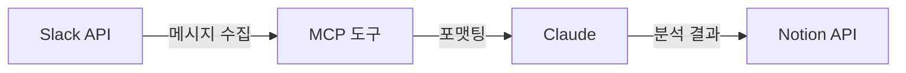

> **TL;DR**<br>
> 비개발자에게 도구를 건네면 막히는 곳은 거의 항상 코드 밖입니다.<br>
> 설치, 토큰 설정, 외부 API 변경, 가이드 문법.<br>
> Slack to Notion 플러그인을 7개월간 다듬으며 4번의 큰 의사결정으로 셀프서비스에 도달했습니다.
{: .prompt-tip }

## 무엇을 만들었나

[claude-slack-to-notion](https://github.com/idean3885/claude-slack-to-notion).
Slack 채널의 대화를 수집하고, Claude가 분석해서, Notion 페이지로 정리하는 도구입니다.



도구는 수집·포맷팅·기록만 하고, 분석은 AI가, 방향은 사용자가 결정합니다.
역할 분리가 단순할수록 비개발자가 자연어로 다루기 쉽습니다.

처음 만들 때부터 사용자는 비개발자였습니다.
"Slack 스레드 200개를 복사해서 AI에 넣으면 중간이 잘린다"는 동료의 불편에서 시작했습니다.

## 1. 명세 먼저, 이슈 단위로

첫 도구라 방법론을 같이 검증했습니다.
이슈를 만들고, 명세를 쓰고, 구현하고, PR을 머지하는 흐름을 모든 변경에 적용했습니다.

명세를 먼저 쓰니까 AI에게 줄 지시가 명확해졌습니다.
"Slack에서 메시지를 가져오는 함수를 만들어줘"가 아니라
"이 명세대로 SlackClient 클래스를 구현해줘"가 됐습니다.

이슈 단위로 나누니 되돌리기도 쉬웠습니다.
Notion Database 방식이 한글 프로퍼티와 충돌하자 페이지 직접 생성으로 전환했는데,
영향 범위가 한 이슈로 닫혀 있어 한 PR로 갈아끼울 수 있었습니다.

## 2. 테스트 기획이 아키텍처를 바꿨다

만들고 나서 비개발자 E2E 시나리오를 쓰기 시작했습니다.

> 1. 설치합니다.

여기서 멈췄습니다.
현행 설치는 `git clone`부터 시작하는 6단계였습니다.
비개발자에게 Git은 낯선 도구입니다.

설치 경로 자체가 비개발자에게 없었습니다.
공식 MCP 서버들의 패턴을 조사하니 `mcp-server-git`이 쓰는 `uvx` 기반 자동 실행이 답이었습니다.

| 옵션 | 장점 | 단점 |
|---|---|---|
| **uvx (선택)** | 공식 패턴, 원커맨드 | PyPI 배포 필요 |
| pip + source | PyPI 불필요 | venv 관리 부담 |
| HTTP 원격 | 설치 없음 | 서버 운영 비용 |
| 현행 유지 | 변경 없음 | 비개발자 사용 불가 |

전환 후 설치는 2단계로 줄었습니다.

```bash
brew install uv                    # 최초 1회
claude mcp add slack-to-notion -- uvx slack-to-notion-mcp
```

> 테스트를 "기획"하는 단계만으로 아키텍처가 바뀌었습니다.<br>
> 시나리오 첫 줄이 설계의 빈틈을 드러냅니다.
{: .prompt-tip }

## 3. 외부 API 변경이 설치를 차단했다

대화형 setup.sh를 만들고 직접 따라가다 Notion API Key 입력에서 무한 루프에 빠졌습니다.

> `✗ 올바른 형식이 아닙니다. secret_ 로 시작해야 합니다.`

정상 발급된 키가 거부됐습니다.
Notion이 Internal Integration Secret 형식을 `secret_`에서 `ntn_`으로 바꾼 것이었습니다.

검증 함수에 단위 테스트가 없으니 외부 변경에 무방비였습니다.
E2E에서 처음 발견됐고, 발견된 시점은 "설치 자체가 불가능한 상태".

`secret_`과 `ntn_` 둘 다 허용하도록 수정하고, 검증 함수에 단위 테스트를 더했습니다.

> 외부 API 의존성은 단위 테스트가 가장 싸게 막아줍니다.<br>
> "동작하니까 넘어가자"가 아니라 "동작하는지 확인하는 코드"가 있어야 합니다.
{: .prompt-warning }

## 4. 실 사용자 피드백: 코드 0건, 문서 5건

직접 E2E를 끝내고 실제 비개발자에게 건넸습니다.

| 구분 | 개발자가 한 E2E | 실제 비개발자 |
|---|---|---|
| 코드 버그 | 5건 | 0건 |
| 문서/UX 이슈 | 2건 | 5건 |

피드백 5건은 전부 가이드의 문제였습니다.

- Slack API UI 버그 (Bot Token 먼저 추가하면 User Token이 잠김)
- Notion Integration URL이 `my-integrations` → `profile/integrations/internal`로 변경
- 단계 순서가 비개발자 흐름과 어긋남 (페이지 생성이 뒤에 옴)
- 개발자 설정과 일반 사용자 설정이 한 섹션에 섞여 혼란
- 분석 선호도 저장 같은 핵심 기능이 가이드에 없음

가이드를 전면 개편하고 Slack 활성 사용자 확인 도구를 추가했습니다.

> 개발자의 "비개발자 관점" 테스트는 결국 개발자의 상상력 안에서의 시뮬레이션입니다.<br>
> Slack API UI 버그는 상상할 수 없었고, Notion URL 변경은 직접 가보기 전엔 몰랐습니다.
{: .prompt-tip }

## 5. 원클릭 설치: JSON을 없앤다

가이드를 다듬어도 남는 단계가 있었습니다.
`claude mcp add` 명령어를 외우거나 JSON 설정 파일을 열어 토큰을 붙여넣는 행위 자체.

Anthropic이 공개한 Desktop Extension(`.mcpb`) 포맷이 답이었습니다.
MCP 서버를 ZIP으로 묶고 `manifest.json`에 사용자 입력 항목을 정의하면,
`.mcpb` 파일을 더블클릭했을 때 Claude Desktop이 토큰 입력 UI를 띄웁니다.

```json
{
  "manifest_version": "0.4",
  "name": "slack-to-notion-mcp",
  "server": {
    "type": "uv",
    "mcp_config": {
      "command": "uv",
      "args": ["run", "slack-to-notion-mcp"]
    }
  },
  "user_config": {
    "slack_user_token": {
      "type": "string",
      "description": "Slack 앱 설정 → OAuth & Permissions → User OAuth Token (xoxp-로 시작)",
      "sensitive": true,
      "required": true
    }
  }
}
```

`sensitive: true`로 마스킹되고, `description`에 발급 방법을 적어두면 입력 화면에서 바로 확인됩니다.

설치 단계는 이렇게 줄었습니다.

| 구분 | uvx 전환 직후 | .mcpb 후 |
|---|---|---|
| 필요 지식 | 터미널, claude mcp add 명령어 | 토큰 3개만 준비 |
| 단계 수 | 6단계 (JSON 편집 포함) | 3단계 (더블클릭 → 토큰 → 활성화) |
| 셀프서비스 | 개발자 도움 필요 | 혼자 가능 |

만드는 중 한 가지 함정. 첫 시도에서 서버가 기동되지 않았습니다.

```
ImportError: attempted relative import with no known parent package
```

`args`를 `["run", "src/slack_to_notion/mcp_server.py"]`로 잡으면 Python이 파일을 독립 스크립트로 실행합니다.
패키지 컨텍스트가 없으니 상대 임포트가 깨집니다.

`pyproject.toml`에 정의된 entry point를 쓰도록 바꿨습니다.

```json
"args": ["run", "slack-to-notion-mcp"]
```

## MCP는 비효율이라 대체되나?

`.mcpb`를 만들며 한 가지 의문이 있었습니다.
MCP가 토큰을 많이 쓰므로 지양된다는 이야기.
반은 맞고 반은 틀립니다.

**맞는 부분**: MCP 서버를 연결하면 도구 정의가 세션 시작 시 컨텍스트에 로드됩니다.
서버 하나당 4,000~8,000 토큰. 7개 연결하면 67,000 토큰이 소비됩니다.

**틀린 부분**: Anthropic이 발표한 Tool Search·코드 실행 패턴은 수십 개의 MCP 서버를 동시에 연결하는 에이전트 환경의 이야기입니다.
Claude Desktop에서 1~2개를 연결하는 일반 사용자에게는 해당하지 않습니다.
MCP는 2025년 12월 Linux Foundation에 기부됐고, 2026년 1월 MCP Apps 스펙이 추가됐습니다.

`.mcpb`는 MCP의 대체가 아닙니다.
내부적으로 동일한 MCP 프로토콜을 쓰고, 바뀌는 것은 설치 UX입니다.

## 회고: 비개발자에게 닿는 도구는 어디서 결정되는가

7개월 동안 4번의 큰 의사결정이 있었습니다.

1. 테스트 기획이 아키텍처를 바꿨다 (uvx 전환)
2. 외부 API 변경은 단위 테스트로 막는다 (ntn_ 사건)
3. 실 사용자 피드백은 코드가 아니라 문서다 (5건 모두 가이드)
4. JSON 수동 편집을 없애야 원클릭 설치다 (.mcpb 채택)

만들면서 가장 자주 한 일은 코드 작성이 아니었습니다.
설치 시나리오를 머릿속이 아니라 빈 디렉토리에서 직접 따라가보고,
가이드를 다듬고,
외부 도구의 UI 변경을 좇아 검증 로직을 보완하는 일이었습니다.

비개발자에게 닿는 도구는 코드 품질만으로 닿지 않습니다.
설치, 설정, 가이드, 외부 의존성이 한 단계라도 무너지면
"동작하는 도구"가 "쓸 수 없는 도구"가 됩니다.

다음 과제는 토큰 발급 자체의 단순화입니다.
Slack 앱을 만들고 Notion Integration을 설정하는 과정은 `.mcpb`로도 해결되지 않는 영역입니다.

---

> 이 글은 Claude와 함께 작업했습니다.
{: .prompt-info }
