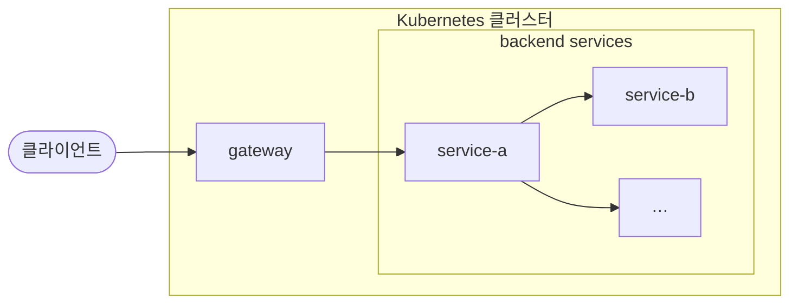

> **TL;DR**<br>
> **OpenTelemetry 로 요청 단위 식별자를 전파해 오류가 난 지점의 `trace_id` 하나로 전 구간을 확인합니다.**<br>
> 사람이든 AI 든 같은 값 하나로 들어가므로 로그를 서비스별로 모아 정리할 일이 없습니다.
{: .prompt-tip }

## 1. 문제: 요청 하나를 특정할 방법이 없었습니다

사이트마다 설치해 납품하는 B2B 제품을 MSA 구조로 운영하고 있습니다.
요청 하나가 지나는 경로는 이렇습니다.



장애나 문의는 보고를 거쳐 조치로 넘어옵니다.
조치는 에러 로그를 찾는 데서 시작하는데, 여기서 셋에 걸렸습니다.

| 걸리는 지점 | 왜 |
|---|---|
| 어느 요청인지 특정할 수 없음 | 같은 시각에 다른 사용자 요청이 섞여 있어 타임스탬프만으로는 한 건을 고를 수 없습니다 |
| 필드로 조회할 수 없음 | 로그가 평문이라 정규식으로 줄 전체를 검색하는 수밖에 없습니다 |
| 역추적할 연결이 없음 | 조사는 에러 로그에서 시작해 거슬러 올라가는데, 그 로그에 같은 요청의 앞뒤 구간으로 이어지는 값이 없습니다 |

로그는 아래와 같은 포맷으로 수집됩니다. 같은 시각대에 두 사용자의 요청이 섞여 있습니다.

```text
14:55:52.676 F {"level":"INFO","requestId":"a1f2","module":"gateway","msg":"POST /v1/volumes"}
14:55:52.681 F {"level":"INFO","requestId":"77c0","module":"gateway","msg":"GET /v1/instances"}
14:55:52.694 F {"level":"INFO","requestId":"a1f2","module":"service-a","msg":"volume create accepted"}
14:55:52.755 F {"level":"ERROR","requestId":"a1f2","module":"service-b","msg":"upstream call timeout"}
14:55:52.802 F {"level":"ERROR","module":"service-c","msg":"scheduled cleanup failed"}
14:55:52.913 F {"level":"INFO","requestId":"a1f2","module":"gateway","msg":"500 response"}
```

오류가 두 건입니다. 넷째 줄은 사용자 요청에서, 다섯째 줄은 스케줄 배치에서 났습니다.

`requestId` 가 있는데 왜 부족한지는 여기서 나뉩니다.
이 값은 gateway 가 헤더로 실어 주고 각 서비스가 받아서 자기 로그에 기록합니다.
`a1f2` 로 걸러내면 사용자 요청 쪽 줄은 남습니다. 거기까지입니다.

| 한계 | 결과 |
|---|---|
| gateway 를 거치지 않는 작업 | 스케줄 배치는 외부 요청 없이 돌아 `requestId` 가 붙지 않습니다. 다섯째 줄을 묶을 값이 없습니다 |
| 관계가 없는 평면 식별자 | `service-a` 가 `service-b` 를 부른 것인지 둘 다 gateway 가 부른 것인지 로그로는 구분되지 않습니다 |
| 구간 소요가 없음 | 각 줄은 시각 한 점입니다. 어디서 시간을 쓴 것인지 알려면 사람이 앞뒤 줄을 짝지어야 합니다 |

그래서 오류 줄을 찾아도 그 요청이 어디를 거쳐 왔고 어디서 시간을 쓴 것인지는 알 수 없습니다.

## 2. 해결방안 모색

### 필요한 것을 먼저 적었습니다

도구를 고르기 전에 조건을 적었습니다.
결과적으로 이 순서가 이후 판단을 전부 결정했습니다.

| 조건 | 이유 |
|---|---|
| 요청 단위 식별자 | 사용자와 시각만으로는 한 건을 특정할 수 없습니다 |
| 서비스를 가로지르는 전파 | 경로에 안 보이는 구간이 하나라도 있으면 거기서 추적이 끊깁니다 |
| 구현 방식과 무관 | 서비스마다 스택이 달라 특정 런타임 전용 방식으로는 경로 전체를 커버할 수 없습니다 |
| 폐쇄망 동작 | 설치형이라 폐쇄망 사이트에 납품됩니다 |
| 조치 시작 시점까지 보존 | 보고를 받아 조치를 시작할 때 그 요청이 남아 있어야 합니다 |

### 후보는 셋이었습니다

| 후보 | 판정 |
|---|---|
| SaaS 형 상용 APM | 폐쇄망 납품이라 후보에서 제외됩니다 |
| 특정 런타임 전용 APM | 대상 런타임 밖의 서비스를 커버하지 못해 두 번째 조건에 미달합니다 |
| 로그 포맷 통일 + 조회 규칙 | 동작은 합니다. 다만 서비스를 연결하는 일을 사람이 계속 해야 합니다 |

세 번째는 실제로 해 본 적이 있는 방식입니다.

### 4년 전에도 같은 조건이었습니다

2022년 삼성카드 통합플랫폼 모니모에서 어뷰징 증적을 만들 때 세 번째 방식을 썼습니다.
Spring MDC 로 고객번호를 로그에 주입하고 포맷을 공통화한 뒤 Kibana KQL 템플릿으로 조회했습니다.
동작은 했습니다. 다만 추적 단위가 요청이 아니라 사용자와 기간이었고 서비스를 연결하는 일은 끝까지 사람이 했습니다.

바꿔야 할 것은 **단위**(사용자 → 요청)와 **연결 주체**(사람 → 데이터)였습니다.

### 여기서 OpenTelemetry 를 알게 됐습니다

찾던 것은 "요청 단위 식별자를 정의하고 구현 방식과 무관하게 전파하는 방법" 이었습니다. 그 자리에 이미 규격이 있었습니다.

자체 정의 대신 이 규격을 고른 이유는 유지 주체가 우리가 아니라는 점입니다.
OpenTelemetry 는 2026년 5월 CNCF 졸업 프로젝트가 됐고 프로젝트 속도는 쿠버네티스 다음입니다.
우리가 떠나도 규격은 남습니다.

OpenTelemetry 가 다루는 신호는 trace·metric·log 셋입니다.
메트릭은 인프라 팀이 맡고 있어 이번에 적용한 것은 추적과 분석에 필요한 **trace** 까지입니다.

용어는 셋만 알면 충분합니다.

| 용어 | 뜻 |
|---|---|
| trace | 요청 하나의 전체 여정. `trace_id` 로 식별합니다 |
| span | 그 여정 안의 한 구간. 고유 `span_id` 를 갖고 같은 `trace_id` 로 묶입니다 |
| 전파 | 서비스 호출 시 `traceparent` 헤더로 두 id 를 전달해 다음 서비스가 자식 span 을 연결하는 것 |

4년 전에는 이 규격을 몰랐고 수집 계층을 담당하지도 않았습니다.
그래서 식별자도 조회 규칙도 직접 정의했습니다.
구조로는 같은 일인데 **누가 그 정의를 유지하는가**가 달랐습니다.

| | 자체 정의 (4년 전) | 표준 규격 (지금) |
|---|---|---|
| 식별자 형식 | 우리가 정하고 우리가 문서화 | W3C Trace Context 가 정의 |
| 전파 방법 | 서비스마다 합의 | `traceparent` 헤더 하나 |
| 새 서비스가 들어올 때 | 우리 규칙을 알려 줘야 함 | 그 스택의 계측 라이브러리를 넣으면 끝 |
| 저장·조회 도구 교체 | 조회 규칙을 다시 작성 | 계측은 그대로. 뒤만 교체 |

## 3. 적용

### `trace_id` 를 서비스마다 전파했습니다

앱 쪽은 의존성과 설정입니다.

```groovy
// 트레이스 계측 + OTLP export
implementation 'io.micrometer:micrometer-tracing-bridge-otel'
implementation 'io.opentelemetry:opentelemetry-exporter-otlp'
```

```yaml
# 전송할 환경에만 둡니다
management:
  otlp:
    tracing:
      endpoint: http://collector:4318/v1/traces
```

**endpoint 를 지정한 환경만 전송하고 미지정 환경은 exporter 가 생성되지 않습니다.**
게이트를 따로 두지 않고도 무영향이 나오는 이유입니다.

구조화 로깅은 Spring Boot 3.4 부터 `logging.structured.format` 설정만으로 됩니다.
그 이상 버전을 쓰고 있어 로그 포맷과 전송 모두 설정으로 끝났습니다.

인프라 쪽은 조건부 서브차트로 구성했습니다.
로그는 필수이고 트레이스와 수집기는 게이트라, 게이트가 꺼지면 렌더링되지 않아 워크로드가 생기지 않습니다.

### 로그는 JSON 으로 통일했습니다

`trace_id` 를 로그에 실어도 로그가 평문이면 그 값으로 조회할 수 없습니다.
그래서 전 서비스의 로그 포맷을 JSON 으로 통일했습니다.

부수 효과가 하나 있었습니다.
수집기(fluent-bit)가 앱 로그 포맷을 알고 파싱하던 결합이 끊겼습니다.
앱이 구조를 갖춰 내보내면 수집기는 그대로 전달하고 해석은 조회 시점의 몫이 되므로, 앱이 로그를 바꿀 때마다 수집기 설정을 함께 고치던 일이 없어집니다.

### 샘플링은 넣지 않았습니다

head 기준 100% 이고 콜렉터 tail 샘플링도 없습니다.
tail 샘플링은 고트래픽에서 "다 저장하면 비싸니 에러와 느린 것만 남기는" 장치입니다.
사이트당 트래픽이 크지 않은 우리 서비스에서는 다 저장해도 양이 적어 그 장치가 필요하지 않습니다.

전수 수집이 두 가지를 함께 성립시킵니다.

| 100% 라서 되는 것 | 왜 |
|---|---|
| 로그와 트레이스의 링크가 끊기지 않음 | 로그만 100% 로 두고 트레이스를 낮추면 로그의 `trace_id` 상당수가 트레이스 백엔드에 없는 트레이스를 참조합니다 |
| 사후에 아무 요청이나 꺼내 볼 수 있음 | 조사는 보고를 받은 뒤에 시작하므로 어느 요청이 대상이 될지 미리 알 수 없습니다. 샘플링은 그때 선택되지 않은 요청을 영원히 볼 수 없게 합니다 |

보존도 같은 이유로 늘렸습니다.
초기 보존이 24시간이었는데 보고와 조치 시작 사이의 시간을 감안하면 짧습니다.
100% 로 2주를 담아도 볼륨이 감당하므로 답은 샘플링이 아니라 보존 상향이었습니다.

## 4. 결과

문제로 적었던 세 가지가 어떻게 됐는지 그대로 대응시킵니다.

| 문제 | 지금 |
|---|---|
| 어느 요청인지 특정할 수 없음 | `trace_id` 하나로 그 요청의 경로 전체를 시간순으로 봅니다 |
| 필드로 조회할 수 없음 | 로그 레벨·모듈·`trace_id` 를 필드로 조회합니다 |
| 역추적할 연결이 없음 | 에러 로그의 `trace_id` 로 같은 요청의 전 구간을 펼칩니다. 전수 수집에 보존 2주라 조치를 시작할 때 그 요청이 남아 있습니다 |

JWT 클레임의 회원 번호도 로그 컨텍스트에 싣고 있습니다.
발생 시각과 사용자 번호로 요청을 특정하고 거기서 `trace_id` 로 나머지 구간을 따라갑니다.
4년 전 MDC 로 만든 사용자 추적과 이번 요청 추적이 여기서 만납니다.

### 분석을 AI 에게 맡길 때 값이 가장 크게 나왔습니다

로그는 Loki 스택으로 수집하고 있어 에이전트에게 조회 권한을 주면 그대로 읽습니다.
**추적성을 확보하고 나서 분석 속도가 올라갔고 잘못 짚는 일이 줄었습니다.**

| | 평문 + 사람이 정리하는 구조 | JSON + `trace_id` |
|---|---|---|
| 에이전트에게 주는 것 | 서비스별로 사람이 모아 정리한 로그 | `trace_id` 하나 |
| 에이전트가 하는 일 | 포맷이 제각각인 텍스트에서 관계를 추측 | 필드로 질의하고 시간순으로 정렬된 전 구간을 읽음 |
| 누락되는 구간 | 사람이 모으지 않은 서비스 | 없음 (전수 수집) |

오류가 줄어드는 지점이 여기입니다.
에이전트가 관계를 추측하면 그럴듯한 오답이 나옵니다. 추측할 자리를 없애면 그 오답도 없어집니다.

샘플링이 없는 것도 여기서 값을 합니다.
그 요청은 수집되지 않았다는 답이 나오면 맡길 수 있는 것도 반쪽이 됩니다.

## 5. 마치며

4년 전에도 같은 문제를 풀었지만 그때는 식별자와 조회 규칙을 직접 정의했습니다.
동작은 했고 성과도 났습니다. 다만 그 정의는 우리 팀 안에서만 통했고 서비스가 늘면 규칙도 같이 늘어나는 구조였습니다.

이번에는 클라우드 네이티브 환경에서 통용되는 표준을 찾아 같은 자리를 채웠습니다.
관측성 수집을 OpenTelemetry 규격에 맞추자 추적성이 따라왔습니다.
**같은 문제를 두 번 푸는 동안 달라진 것은 문제 해결 여부가 아니라 그 해법이 조직 밖에서도 통하는가였습니다.**

여기까지가 이번에 적용한 범위입니다.
메트릭에서 트레이스로 가는 역추적은 아직 적용하지 않았습니다.
exemplar 를 붙이면 지표에서 이상 구간을 짚어 바로 그 요청으로 내려갈 수 있는데, 지금은 로그에서 트레이스로 가는 한 방향입니다.

> 이 글은 Claude와 함께 작업했습니다.
{: .prompt-info }
